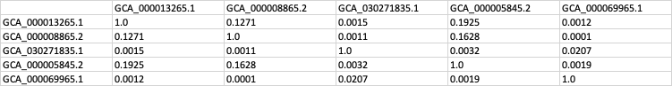

Rapport PHYG TP_2

L'objectif de ce TP est de calculer les indices de Jaccard entre les paires d'organismes pour identifier les similarités entre leurs génomes. Ces indices permettront de retrouver les familles présentes en comparant les séquences de k-mers extraites des génomes. Les fichiers nécessaires sont fournis dans le répertoire TP.

__init__.py : Fichier d'initialisation du module.

loading.py : Contient la fonction de chargement des fichiers.

kmers.py : Contient les fonctions pour manipuler et comparer les k-mers.

Les fichiers fasta utilisés pour l'analyse sont les suivants (téléchargés de la base de données European Nucleotide Archive - ENA) et sur GenBank (pour les eucaryotes)

    GCA_000013265.1.fasta.gz (Escherichia coli UTI89)
    GCA_000008865.2.fasta.gz (Escherichia coli O157)
    GCA_030271835.1.fasta.gz (Proteus appendicitidis)
    GCA_000005845.2.fasta.gz (Escherichia coli K-12 MG1655)
    GCA_000069965.1.fasta.gz (Proteus mirabilis HI4320)
    GCA_000001635.9_GRCm39_genomic.fna.gz (Singe)
    GCA_000001405.29_GRCh38.p14_genomic.fna (Humain)
    GCA_000001635.9_GRCm39_genomic.fna (Souris)

Méthodes implémentées dans le kmers.py

    encode_nucl : Encode un nucléotide en un entier de 2 bits.

    xorshift : Applique une fonction de xorshift sur la valeur d'un k-mer pour générer son complément inverse. Cela permet de produire des valeurs uniques pour chaque k-mer et son complément, facilitant ainsi la comparaison.

    stream_kmers : Génère des k-mers et leurs compléments inversés à partir d'une séquence. Cette fonction parcourt la séquence et produit des k-mers par glissement, en calculant également le complément inverse de chaque k-mer pour une comparaison.

    filter_smallests : Filtre et retourne les plus petits k-mers ou r-kmers. Cette fonction est utilisée pour créer un sketch de taille fixe, contenant les plus petits k-mers ou r-kmers d'une séquence. Cela permet de réduire la quantité de données à comparer tout en conservant une représentation significative de la séquence.

La démarche pour filter_smallests consiste à générer tous les k-mers possibles d'une séquence, puis à sélectionner uniquement les plus petits, selon un critère de taille fixe (sketch size). La méthode utilise un tableau de taille fixe initialisé avec des valeurs infinies. Chaque k-mer est comparé à l'élément maximum du tableau et remplace cet élément si il est plus petit, maintenant ainsi les plus petits k-mers dans le tableau.

Méthodes implémentées dans le __main__.py :

1. Fonction `load_directory` : Charger tous les fichiers FASTA (compressés ou non) d'un répertoire donné. 
     - Parcourt le répertoire spécifié.
     - Pour chaque sous-répertoire (échantillon), crée une entrée dans un dictionnaire.  Initialisation de la taille des kmers à extraire + la taille des sketchs qui seront triés.
     - Charge les séquences d'ADN à partir des fichiers FASTA dans chaque sous-répertoire et les ajoute à la liste correspondante dans le dictionnaire.

2. Fonction `filter_smallests` :
     - Génère tous les k-mers possibles à partir de la séquence d'ADN en utilisant des transformations numériques pour les représenter de manière compacte. Conservation d'uniquement les plus petits k-mers (définis par `sketch_size`). Retourne une liste triée de ces petits k-mers.

3. Fonction `jaccard_from_sorted_lists` :
     - Utilise deux indices pour parcourir les deux listes de k-mers.
     - Compte les k-mers communs (intersection) et l'ensemble total des k-mers (union).
     - Calcule l'indice de Jaccard comme le ratio de l'intersection sur l'union, mesurant ainsi la similarité entre les deux ensembles de k-mers triés.

4. Création des Sketches de k-mers :
    Préparer les données pour le calcul de la similarité de Jaccard.
     - Pour chaque fichier, initialise une liste vide pour stocker les k-mers.
     - Pour chaque séquence dans le fichier, utilise `filter_smallests` pour extraire les k-mers et les ajoute à la liste. La liste de k-mers pour chaque fichier est triée, pour une comparaison entre les listes.

5. Calcul des Similarités de Jaccard :
     - Pour chaque paire, utilise `jaccard_from_sorted_lists` pour calculer l'indice de Jaccard. Affichage du résultat de la similarité pour chaque paire.

Le traitement de séquences des génomes eucaryotes a été trop long (supérieur à 30min) donc j'ai uniquement gardé le résultat pour les génomes bactériens. La taille de k est fixée à 21 et la taille des sketchs est fixée à 10000.

Nouvelle matrice de jaccard calculée avec les sketches :

    Les échantillons GCA_000013265.1 et GCA_000008865.2 ainsi que GCA_000005845.2 montrent des similarités élevées. Cela indique que ces échantillons ont un contenu en k-mers similaire, ce qui peut suggérer qu'ils appartiennent à la même espèce ou à des espèces très proches. Cela est cohérent avec l'idée que ces souches pourraient partager des caractéristiques génétiques importantes.

    Les échantillons GCA_030271835.1 et GCA_000069965.1 ont des valeurs de similarité très faibles (0.0015 et 0.0012 respectivement) avec les autres échantillons. Cela indique une divergence importante et suggère qu'ils appartiennent probablement à des espèces différentes. Le fait que les échantillons GCA_030271835.1 et GCA_000069965.1 aient des valeurs très basses de similarité avec les autres suggère qu'ils pourraient appartenir à des genres différents au sein de la même famille bactérienne (proteus).

    Les valeurs élevées entre certaines souches (comme GCA_000013265.1 et GCA_000008865.2) soulignent des similarités réelles qui sont plus représentatives grâce à la réduction de complexité des données.
    La matrice avec sketches montre des valeurs plus nuancées et plus faibles que la matrice sans sketches, qui semblent mieux correspondre à la compréhension phylogénétique des échantillons. Les valeurs plus faibles entre les souches distantes (comme celles des souches GCA_030271835.1 et GCA_000069965.1) confirment leur divergence évolutive.